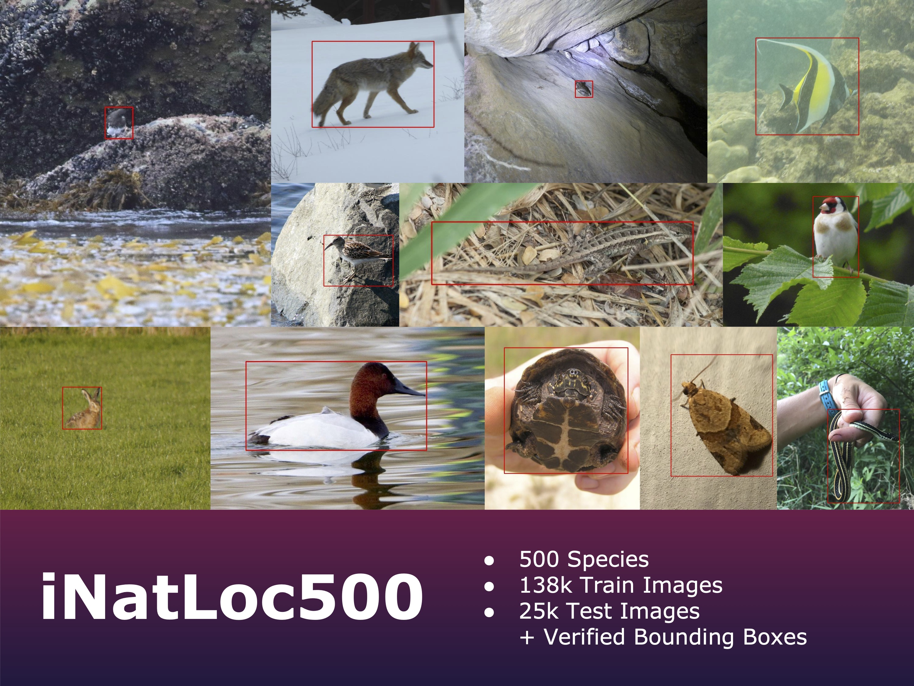
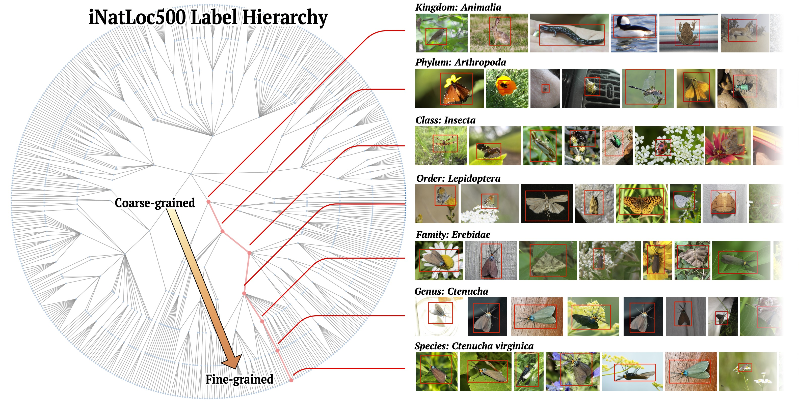

# The iNatLoc500 Dataset
The iNaturalist Localization 500 (iNatLoc500) dataset is a large-scale fine-grained dataset for weakly supervised object localization (WSOL). This dataset was released as part of the paper [On Label Granularity and Object Localization](https://arxiv.org/abs/2207.10225) (ECCV 2022).

## Splits

Split | # Species | # Images | Avg. # Images per Species | Image-Level Labels? | Bounding Boxes? | Purpose
--- | --- | --- | --- | --- | --- | ---
Train | 500 | 138k | 276 | Yes | No | Classifier training
Val | 500 | 12.5k | 25 | Yes | Yes | Localization evaluation
Test | 500 | 12.5k | 25 | Yes | Yes | Localization evaluation

## Label Hierarchy

iNatLoc500 is equipped with a label hierarchy based on the biological tree of life. The levels of the label hierarchy are (from finest to coarsest): `species`, `genus`, `family`, `order`, `class`, `phylum`, `kingdom`. Since all of the species in iNatLoc500 are animals, the `kingdom` level has only one node (`Animalia`). The iNatLoc500 dataset can be labeled at any level of the label hierarchy. For convenience we provide metadata files for each level of the label hierarchy, as described [here](dataset/README.md).



# Download Instructions
Instructions for downloading the dataset can be found [here](dataset/README.md). 

# Reference
If you find our work useful in your research please consider citing our paper:  

```latex
@inproceedings{cole2022label,
  title={On Label Granularity and Object Localization},
  author={Cole, Elijah and 
          Wilber, Kimberly and 
          Van Horn, Grant and 
          Yang, Xuan and 
          Fornoni, Marco and 
          Perona, Pietro and 
          Belongie, Serge and 
          Howard, Andrew and 
          Mac Aodha, Oisin},
  booktitle={European Conference on Computer Vision},
  year={2022},
  organization={Springer}.
}
```
